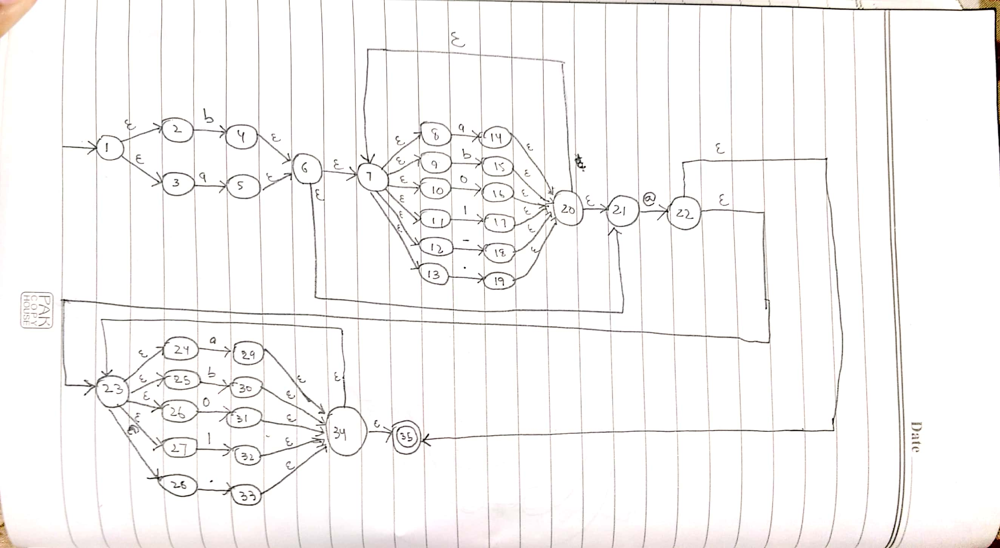
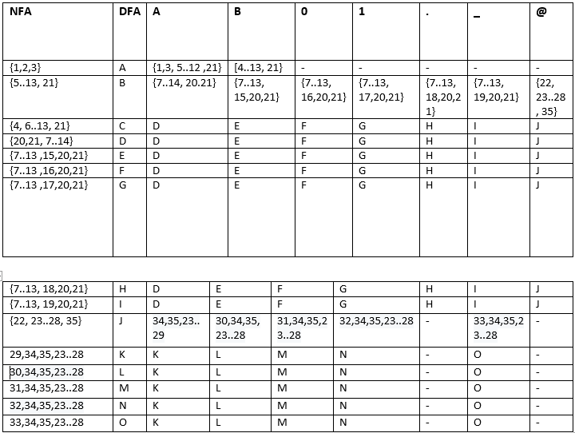
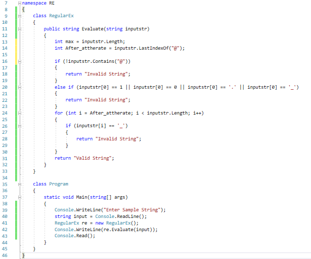

# Class Activity 1

## Regular Expression
```
( a + b )( a + b + 0 + 1 + . + _ )* @ ( a + b + 0 + 1 + . )*
```
## NFA from Regular Expression



## Transition Table



## DFA from NFA


## CODE




